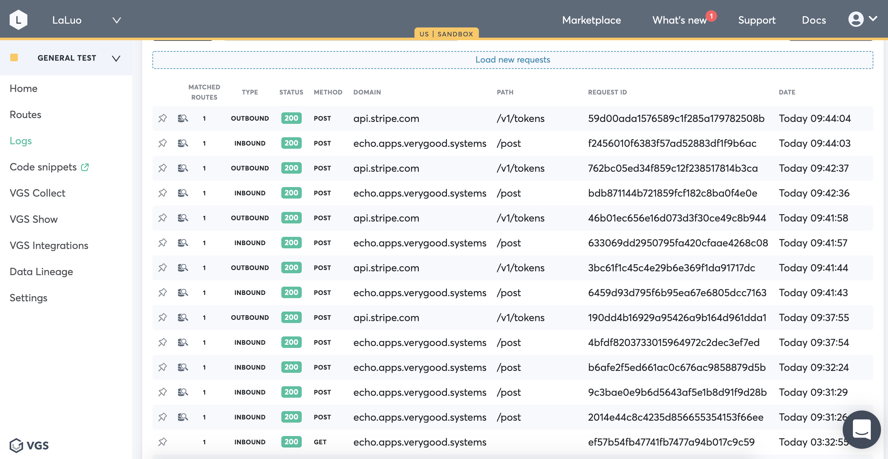

<p align="center"><a href="https://www.verygoodsecurity.com/"></a></p>
<p align="center"><b>Pull Logs with VGS Cli Auto Login</b></p>


### Get auto-login credentials

Contact support@verygoodsecurirty.com to get client credentials following https://www.verygoodsecurity.com/docs/vgs-cli/commands#auto-login 

### Prepare files for configuration
Copy the docker-compose.yaml to local directory and set up `.env` file following https://www.verygoodsecurity.com/docs/vgs-cli/docker#run

### Set up cron job
Set up cron job to run, for example, every 5 minutes  
```
PATH=/usr/local/bin
*/5 * * * * cd /Users/absolute path to your project/vgscli-auto-logs && docker-compose run cli vgs logs access --vault tntza6lqen2 --since 5m >> cron_res.yaml
```
You can also add option `--output, -o` to set output format as `json`. Defaults to `yaml` if unspecified.

### Check pulled logs
Compare the downloaded `cron_res.yaml` with your dashboard access logger, you will see you have pulled the complete logs

```yaml
data:
- attributes:
    data_environment: sandbox
    expired_at: '2020-11-24T18:31:26+00:00'
    http:
      method: POST
    occurred_at: '2020-11-24T17:31:26.473000+00:00'
    path: https://echo.apps.verygood.systems:443/post
    pinned: false
    protocol: http
    proxy_status: '200'
    route_type: reverse
    routes:
      data:
      - attributes:
          matched: true
          route_id: cdbc4951-a056-4054-bc41-e52aff9fe8c9
          trace_id: 2014e44c8c4235d856655354153f66ee
        id: 7039108b-8430-4bd1-9e08-87e92a51f4a3
        type: routes
    source: ''
    tenant_id: tntza6lqen2
    trace_id: 2014e44c8c4235d856655354153f66ee
    upstream: echo.apps.verygood.systems:443
    upstream_status: '200'
    upstream_time_ms: 18
    user_id: ''
  id: 2014e44c8c4235d856655354153f66ee
  links:
    self: /access-logs/2014e44c8c4235d856655354153f66ee
  type: access-log
...
```

